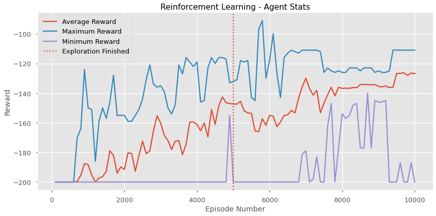
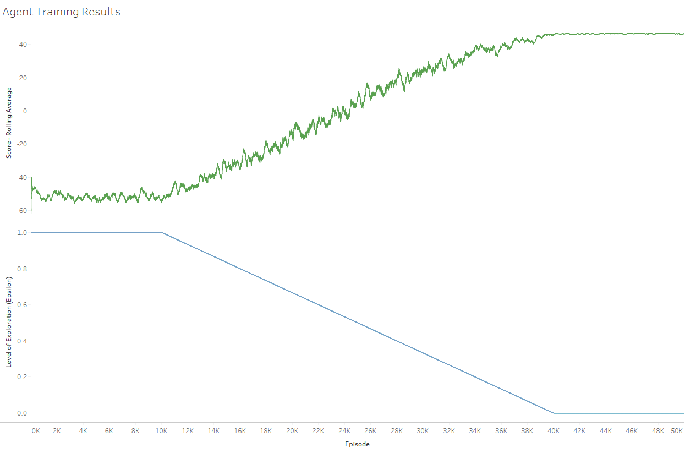

# Reinforcement Learning
## Learning to Checkmate with Q-Tables

This is an exploratory and training repo. My first real dive into q-learning.

1. First, I take my first steps into reinforcement learning using the python package  `gym` and their wonderful `mountain-car` environment.
  - `intro_q_learning_gym.ipynb`

## Gym Environment: Mountain Car

2. I then dive headfirst into creating an environment, a t-table mapping, and use the strategies outlined in the first notebook to learn the basics of chess.
  - `q_learning_chess.ipynb`
  
## Custom Environment: Chess
### 4x4 Board || King + Rook vs King

